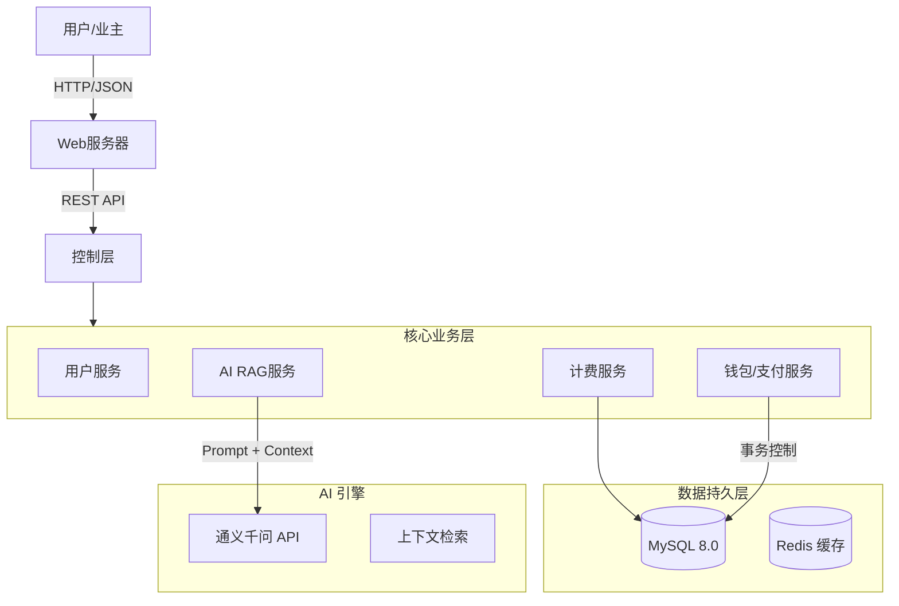

# 智慧物业管理系统
[](https://spring.io/projects/spring-boot)
[](https://www.oracle.com/java/)
[](https://www.mysql.com/)
[](LICENSE)
[](https://help.aliyun.com/zh/dashscope/developer-reference/api-details)

> **标准化物业管理解决方案**。基于 Spring Boot 3 与 MySQL 构建，深度集成 RAG (检索增强生成) 架构的 AI 智能助手，提供从业主档案、资产管理到财务风控的全链路闭环管理能力。

[🇺🇸 English Documentation](./docs/README.md) | [📚 完整技术文档](./docs/README.md)

---

## 🌟 核心特性 (Key Features)

### 1. 🛡️ 严密的风控体系
- **欠费硬熔断机制**：独创的“倒逼缴费”风控逻辑。系统实时监控物业费/取暖费缴纳状态，一旦检测到欠费，自动通过拦截器锁定水电卡充值入口。
- **RBAC 权限控制**：基于角色的动态鉴权（管理员/业主），确保数据边界安全。

### 2. 🧠 RAG 架构 AI 助手
- **上下文感知**：集成阿里云通义千问大模型，结合向量检索技术，让 AI "读懂" 用户的实时账单与资产状况。
- **智能客服**：支持自然语言查询（如“我还欠多少钱？”，“怎么交电费？”），提供基于事实的业务指引。

### 3. 💳 闭环财务系统
- **双轨支付架构**：独立设计的“用户钱包”与“水电卡”账户体系，支持余额互转、流水审计与对账。
- **自动化计费**：支持按周期批量生成账单，自动计算滞纳金与欠费账龄。

### 4. 📊 数据可视化决策
- **宏观看板**：内置 ECharts 动态大屏，实时展示社区收费率、高风险楼栋 TOP5、财务收入分布等核心 KPI。

---

## 🛠️ 技术栈 (Tech Stack)

| 领域 | 技术选型 | 说明 |
| :--- | :--- | :--- |
| **后端核心** | Spring Boot 3.2.1 | 采用最新版框架，支持 AOT 编译优化 |
| **数据持久化** | Spring JDBC Template | 纯手工 SQL 优化，确保复杂查询性能与安全性 |
| **数据库** | MySQL 8.0 | 严格遵循 3NF 范式设计，支持 ACID 事务 |
| **前端架构** | HTML5 + ES6 | 轻量级原生开发，集成 ECharts 5 与 Marked.js |
| **AI底座** | Aliyun DashScope SDK | 接入通义千问 Max 模型，实现 RAG 逻辑 |

---

## 🏗️ 系统架构 (Architecture)



---

## 🚀 快速开始 (Quick Start)

### 环境要求
- JDK 21+
- Maven 3.8+
- MySQL 8.0+

### 部署步骤

1. **克隆仓库**
   ```bash
   git clone https://github.com/aronnaxlin/NUC-Java-Database-Course-Design.git
   ```

2. **数据库初始化**
   ```bash
   mysql -u root -p < sql/schema.sql
   mysql -u root -p < sql/data.sql
   ```

3. **配置环境**
   复制 `.env_template` 为 `.env` 并填入配置：
   ```ini
   DB_HOST=localhost:3306
   DB_USER=root
   DB_PASS=your_password
   # AI 功能需配置 (可选)
   AI_API_KEY=sk-xxxxxx
   ```

4. **启动服务**
   ```bash
   mvn spring-boot:run
   ```
   访问地址: `http://localhost:8081`

---

## 📂 项目文档 (Documentation)

我们提供了完整的企业级开发文档，位于 `/docs` 目录：

- [📖 项目白皮书 (README)](./docs/README.md) - 系统全貌与核心逻辑
- [🏗️ 架构设计 (Architecture)](./docs/ARCHITECTURE.md) - 业务流程图与 RAG 架构详解
- [🔌 API 参考 (API Reference)](./docs/API.md) - RESTful 接口定义与错误码
- [💾 数据库概览 (Database)](./docs/DATABASE.md) - ER 图、索引策略与范式说明
- [⚙️ 运维指南 (Operations)](./docs/OPERATIONS.md) - 部署、监控与故障排查

---

## 👨‍💻 作者 (Author)

**Aronnax**

- Email: lilinhan917@gmail.com
- GitHub: [@aronnaxlin](https://github.com/aronnaxlin)

---

## 📄 许可证 (License)

本项目基于 [MIT License](LICENSE) 开源。
