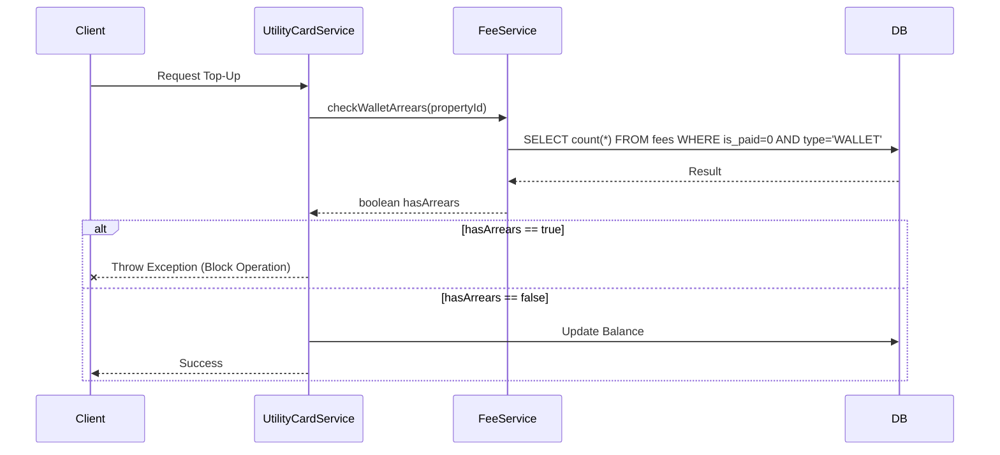

# System Architecture & Business Logic

## 1. Core Component Interactions
The system employs a service-oriented logic layer where `Service` components orchestrate business rules across domain boundaries.

### 1.1 Service Layer Dependency Graph
- **`UserService`**: Core authentication and identity management.
- **`FeeService`**: Manages billing, payments, and arrears calculation.
- **`UtilityCardService`**: Handles utility (water/electricity) card operations.
- **`AIService`**: Orchestrates LLM interactions and context retrieval.

---

## 2. Critical Business Logic: "Arrears Circuit Breaker"

### 2.1 The Problem
In property management, residents often neglect property management fees while prioritizing utility payments (water/electricity) due to their immediate necessity.

### 2.2 The Solutuion: Hard-Lock Interception
The system implements a **"Mandatory Compliance Strategy"** by tightly coupling utility services with property fee status.

**Rule Definition**:
> *If a property has any outstanding "Wallet-type" fees (Property Management or Heating Fees), all top-up operations for Utility Cards (Water or Electric) associated with that property are strictly blocked.*

### 2.3 Implementation Details
The logic is enforced at the Service layer to ensure consistency across all entry points (API, Batch Jobs, Admin Console).

**Sequence Flow**:
1.  **Request**: `UtilityCardService.topUp(cardId, amount)` called.
2.  **Pre-check**: Retrieve `PropertyID` associated with the card.
3.  **Cross-Service Call**: Invoke `FeeService.checkWalletArrears(propertyId)`.
4.  **Verification**:
    - `FeeService` queries database for `(fee_type IN ('PROPERTY', 'HEATING') AND is_paid=0)`.
    - If Arrears Found: `FeeService` returns `true`.
5.  **Enforcement**: `UtilityCardService` throws `IllegalStateException`, aborting the transaction and rolling back any changes.

**Mermaid Sequence Diagram**:


---

## 3. AI Architecture: RAG Integration

### 3.1 Overview
The AI module uses **Retrieval-Augmented Generation (RAG)** to provide context-aware responses. It does not merely chat; it acts as an intelligent interface to live business data.

### 3.2 Component Design (MVC+S)
- **`AIConfig`**: Adapts standard OpenAI-compatible interfaces (e.g., Aliyun Qwen). Includes graceful degradation (Offline Mode) if keys are missing.
- **`AIController`**: Enforces session-based security. Prevents Prompt Injection via input sanitization.
- **`AIDataService`** (The "Retriever"): Aggregates real-time data from `FeeDAO`, `WalletDAO`, and `KPI` modules.
- **`AIService`** (The "Generator"): Constructs dynamic prompts injecting the retrieved data as "System Context".

### 3.3 Data Flow
1.  **Authentication**: User identity verified via Session.
2.  **Intent Analysis & Retrieval**: System identifies user role (Owner vs Admin).
    - *Owner Context*: Pulls personal arrears, wallet balance, and card status.
    - *Admin Context*: Pulls community-wide financial KPIs and risk alerts.
3.  **Prompt Assembly**:
    ```text
    [System]: You are a property assistant.
    [Context]: Current user has 2 unpaid bills totaling 500 CNY.
    [User]: How much do I owe?
    ```
4.  **Inference**: LLM generates fact-based response using the injected context.
5.  **Fallback**: If LLM service is unreachable, a local rule engine provides static responses for critical keywords (e.g., "Pay Bill").

---

## 4. Security & Patterns

- **Transaction Management**: `@Transactional` ensures atomicity for all financial operations.
- **Input Sanitization**: All Search Endpoints validate length and special characters to prevent abuse.
- **Privacy Barrier**: The AIChat module strictly isolates context generation—Tenant A cannot influence or view Tenant B's data context.
