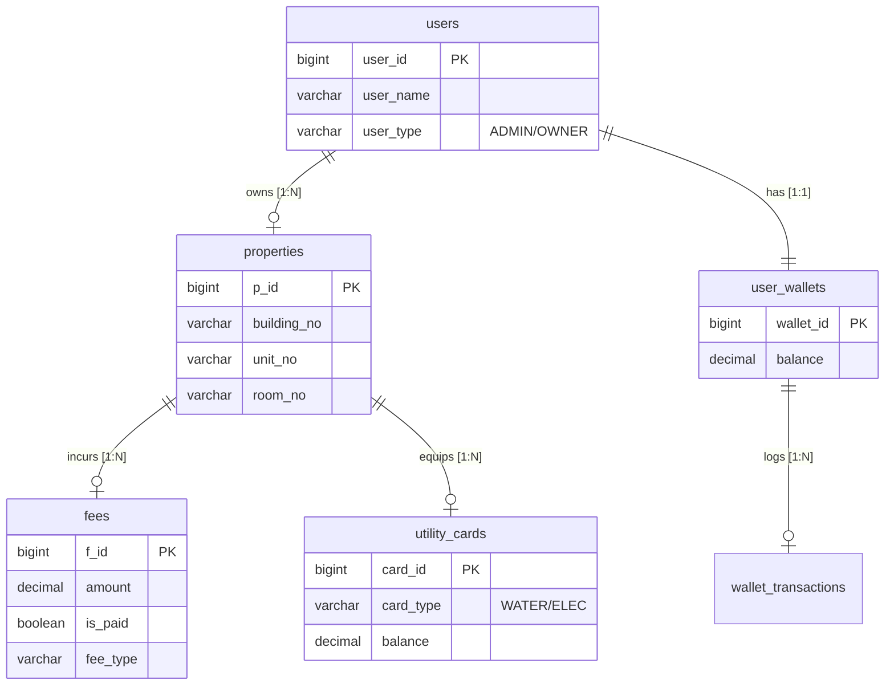

# Database Design Specification

## 1. Schema Overview

The `property_management` database follows **Third Normal Form (3NF)** to ensure data integrity and reduce redundancy. It employs a centralized `users` table with flattened hierarchy for role management and utilizes foreign keys with cascading actions for lifecycle consistency.

### 1.1 ER Diagram



---

## 2. Table Definitions

### 2.1 `users`
Core identity table storing both Administrators and Owners.
- **Constraints**:
  - `user_type` IN ('ADMIN', 'OWNER')
- **Indexes**: `idx_user_name` (Login lookup).

### 2.2 `properties`
Real estate assets managed by the system.
- **Foreign Key**: `user_id` -> `users(user_id)` (Set NULL on delete).
- **Unique Key**: `(building_no, unit_no, room_no)` ensures physical address uniqueness.

### 2.3 `fees`
Financial liabilities associated with a property.
- **Foreign Key**: `p_id` -> `properties(p_id)` (Cascade delete).
- **Optimization**: `idx_check_arrears (p_id, is_paid)` facilitates the high-frequency *Arrears Circuit Breaker* check.

### 2.4 `utility_cards`
Prepaid cards for metering utility usage.
- **Constraints**: One card per type (Water/Elec) per property.
- **Unique Key**: `(p_id, card_type)`.

### 2.5 `user_wallets` & `wallet_transactions`
The embedded financial system.
- **Relation**: 1-to-1 mapping between `users` and `user_wallets`.
- **Audit**: `wallet_transactions` is an append-only ledger for all balance changes.

---

## 3. Storage & Performance

### 3.1 Engine Configuration
- **Engine**: InnoDB (Transaction Support required).
- **Charset**: `utf8mb4_unicode_ci` (Full Unicode support).

### 3.2 Indexing Strategy
| Table | Index Columns | Purpose |
| :--- | :--- | :--- |
| `fees` | `(p_id, is_paid)` | Optimizes the "Block Top-Up if Unpaid" query. |
| `users` | `(name)`, `(phone)` | Accelerates Admin search operations. |
| `wallet_transactions` | `(wallet_id, trans_time)` | Optimizes transaction history retrieval (descending order). |

---

## 4. Connection Pool Settings (HikariCP)
Recommended production settings for high concurrency:
```properties
spring.datasource.hikari.maximum-pool-size=20
spring.datasource.hikari.minimum-idle=5
spring.datasource.hikari.idle-timeout=30000
spring.datasource.hikari.connection-timeout=30000
```
